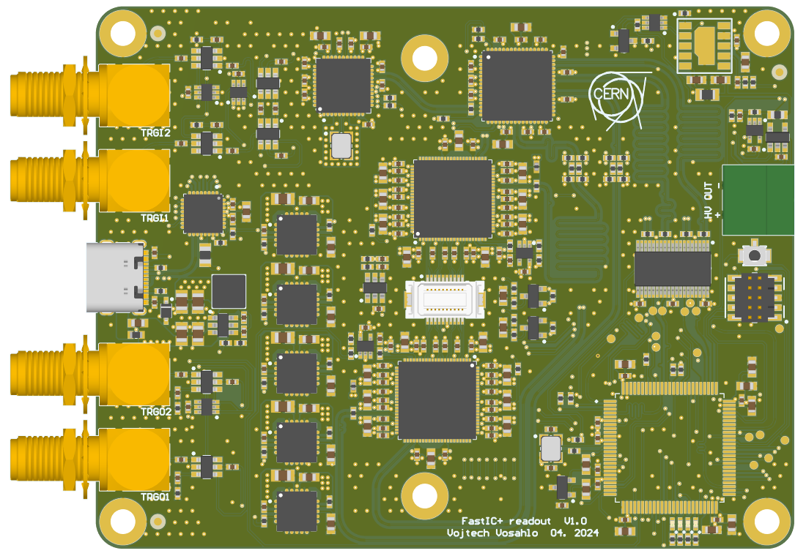

# FastIC+ readout 

This repository contains the project files and manufacturing outputs for the FastIC+ readout. The files for the [userboard](https://github.com/WojtaCZ/fastic-userboard-hw) are also available to simplify development of sensor boards compatible with the readout.

  
   

