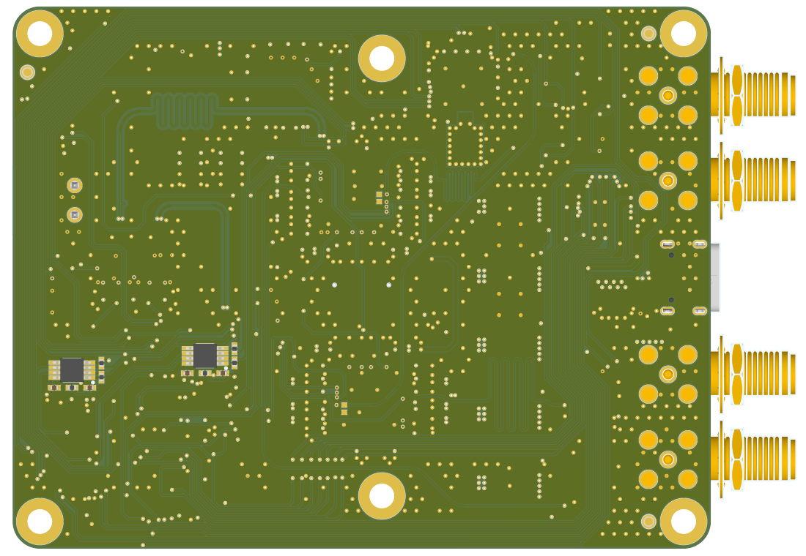

# FastIC+ readout 

This repository contains the project files and manufacturing outputs for the FastIC+ readout. The files for the [userboard](https://github.com/WojtaCZ/fastic-userboard-hw) are also available to simplify development of sensor boards compatible with the readout.

  
   </img>
   

## Output files
Schematic, BOM and 3D renders are available in the outputs folder aswell as the gerbers and pick and place files needed for assembly. Gerbers and P&P files for both a single board and a 2x2 panel are provided.
